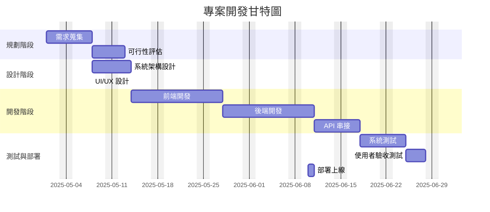

---
{"dg-publish":true,"permalink":"/2025-05-05/"}
---

## PlantUML 測試1

```plantuml
!theme sketchy

  

rectangle "登入畫面" {

[帳號欄位]
[密碼欄位]
[登入按鈕]

}

@enduml
```

## Mermaid 測試

```mermaid
gantt
    title 專案開發甘特圖
    dateFormat  YYYY-MM-DD
    excludes    weekends

    section 規劃階段
    需求蒐集           :a1, 2025-05-01, 5d
    可行性評估         :a2, after a1, 3d

    section 設計階段
    系統架構設計       :b1, 2025-05-08, 4d
    UI/UX 設計         :b2, 2025-05-08, 6d  %% 與 b1 同一天開始

    section 開發階段
    前端開發           :c1, 2025-05-14, 10d
    後端開發           :c2, after c1, 10d
    API 串接           :c3, after c2, 5d

    section 測試與部署
    系統測試           :d1, after c3, 5d
    使用者驗收測試     :d2, after d1, 3d
    部署上線           :d3, 2025-06-10, 1d
```